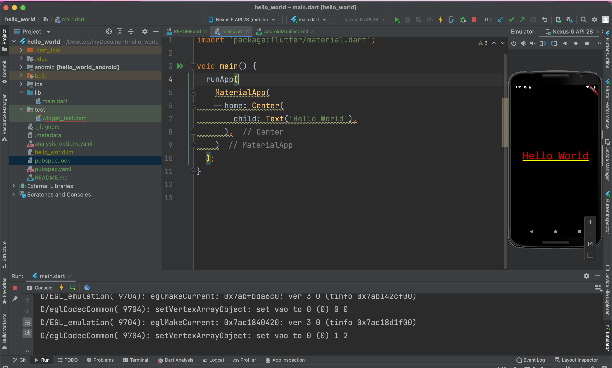
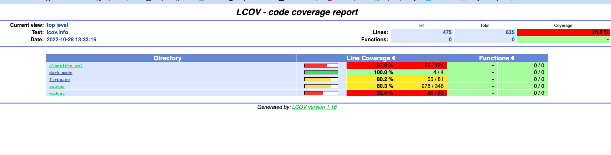
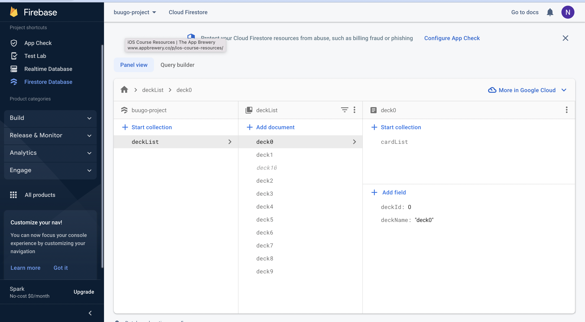

# Nhóm 20 - INT3020 40
## Thành viên
- Nguyễn Hải Nam - 21020110
- Phạm Đức Thắng - 20020156

## Báo cáo quá trình

### Tuần 02 - Run "Hello World!"
+ Cài đặt Flutter và Android Studio, thực hiện code giao diện "hello world!"
+ Ảnh chụp màn hình run code, ảnh chụp màn hình điện thoại mô phỏng

### Tuần 07 - Mức độ bao phủ test

### Tuần 11 

